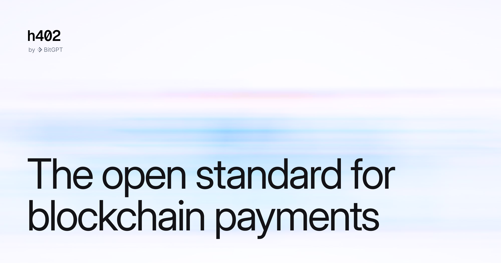

# HTTP 402 protocol



HTTP 402 is the web-native standard for payments. Our mission is to design a frictionless machine-to-machine protocol that allows agents to pay for APIs, compute resources, and data using simple HTTP requests and native blockchain transactions scaling to billions of sub-cent microtransactions.

This unlocks a previously unattainable economic layer for AI-native commerce, while simultaneously delivering a best-in-class user experience for humans.

```js
// This is an example of how our package can be integrated with NextJS middleware
// You can check out the sections below to find more implementation options
// Or reach out to us at hello@bitgpt.xyz
export const middleware = h402NextMiddleware({
   routes: {
      "/api/paywalled_route": {
         paymentRequirements: [{
            namespace: "evm",
            tokenAddress: "0x55d398326f99059ff775485246999027b3197955", // USDT on BSC
            tokenType: "ERC20",
            tokenDecimals: 18,
            tokenSymbol: "USDT",
            amountRequired: 0.01, // 0.01 USDT
            amountRequiredFormat: "humanReadable",
            payToAddress: "0xd78d20FB910794df939eB2A758B367d7224733bc",
            networkId: "56", // BSC Chain ID
         }]
      }
   },
   paywallRoute: "/paywall"
});

export const config = {
   matcher: ["/api/paywalled_route"]
};
```

This protocol builds on top of the scheme from [x402](https://github.com/coinbase/x402), to ensure the continuation and adoption of a true open standard. You can check our [FAQs](https://bitgpt.xyz/faq402) to learn more.


## Supported networks and schemes

Currently, h402 supports:

Networks:

- All EVM-compatible chains (Ethereum, Binance Smart Chain, Base, etc.)
- Solana (mainnet)

Payment Types:

- Signed payloads (permit-based tokens like USDC)
- Broadcasted transactions (for tokens like USDT and native currencies like BNB/ETH)
- Solana transactions with memo (for SOL and SPL tokens)

Payment schemes:

- `exact`: Fixed amount payments with predefined values

We're actively expanding support for additional networks, tokens, and payment schemes. See our [roadmap](#roadmap) for upcoming implementations including Bitcoin, and new payment models like `upto`, `streamed`, and `subscription`.

## Protocol

HTTP 402 is the web-native standard for payments. Our mission is to design a frictionless machine-to-machine protocol that allows agents to pay for APIs, compute resources, and data using simple HTTP requests and native blockchain transactions, scaling to billions of sub-cent microtransactions.

This unlocks a previously unattainable economic layer for AI-native commerce, while simultaneously delivering a best-in-class user experience for humans.

We decided to create `h402`, which simply stands for `HTTP 402`, based on the open schemes provided by [x402](https://github.com/coinbase/x402).

The reason for spinning off into a separate project comes down to a few key points, you can read them in our [FAQs.md](./FAQs.md) or at our website [h402.xyz](https://h402.xyz).

> We're a fairly small team, so this repo is evolving rapidly we'll be updating it weekly (or even daily) with new details, schemes, and examples.
> In the meantime, if anything's missing or underspecified, you can check out the original x402 repository for reference.
> Eventually, this message will disappear because we genuinely believe this will become the leading implementation of the 402 protocol, or we will find a way to merge with x402.

## Example Next application

In the `example/` folder we've provided a simple demo of a Next webapp integrating both the facilitator (server) and the client to restrict access to a specific page under a 402 payment required response.

It works utilizing this package and its functionalities and provides a quick example of how such an integration can be made, including the UI for the wallet connection & send.

## Development Setup

This project is set up as a pnpm monorepo workspace, allowing for seamless development across multiple packages.

### Prerequisites

- [Node.js](https://nodejs.org/) (see `.nvmrc` for version)
- [pnpm](https://pnpm.io/) package manager

### Workspace Structure

The monorepo contains the following workspaces:

- `typescript/package`: The main `@bit-gpt/h402` package
- `typescript/example`: Example Next.js application using the package
- `typescript/facilitator`: Facilitator implementation

### Getting Started

1. Install dependencies:

   ```bash
   pnpm install
   ```

2. Run the example application:
   ```bash
   pnpm dev:example
   ```

### Development Workflow

The monorepo is configured with the following workflow:

1. **Dependency Management**:

   - All dependencies are hoisted to the root `node_modules` directory
   - Workspace packages reference each other using `workspace:*` syntax
   - No need for manual linking between packages

2. **Build Process**:

   - `pnpm build`: Builds all packages in the monorepo (use when you need to build everything)
   - `pnpm build:package`: Builds only the main `@bit-gpt/h402` package (sufficient for most development)
   - `pnpm clean`: Cleans build artifacts from all packages

3. **Development Commands**:

   - `pnpm dev:example`: Builds the main package and starts the example Next.js application
   - Changes to the package code require rebuilding before they're available to the example

4. **Configuration**:
   - The root `.npmrc` file contains important configuration for the monorepo
   - `pnpm-workspace.yaml` defines the workspace package locations

### Adding New Packages

To add a new package to the monorepo:

1. Create a new directory in the appropriate location
2. Add a `package.json` with the package details
3. Add the package path to `pnpm-workspace.yaml`
4. Run `pnpm install` to update the workspace

### Troubleshooting

If you encounter "Module not found" errors when running the example:

1. Make sure all packages are built: `pnpm build`
2. Check that the package exports are correctly defined in the package.json
3. Verify that the imports in your code match the export paths

## Current schemes and types

The only available scheme for now is `exact`, the types are the following.

All the types can be found [here](https://github.com/bit-gpt/h402/tree/main/typescript/package/src/types)

## FAQs

See [FAQs.md](./FAQs.md) or our website [h402.xyz](https://h402.xyz)

## Roadmap

See [ROADMAP.md](./ROADMAP.md).

## Community

Join our [Discord community](https://bitgpt.xyz/discord) to stay up to date, contribute to feature development, and connect directly with our team.

## Playground

See [PLAYGROUND.md](./PLAYGROUND.md).

## License

The h402 protocol is licensed under the [Apache-2.0](https://github.com/coinbase/x402/blob/main/LICENSE.md) license.
